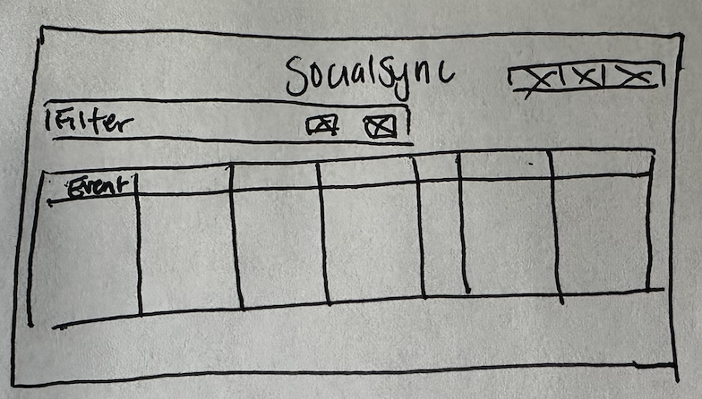
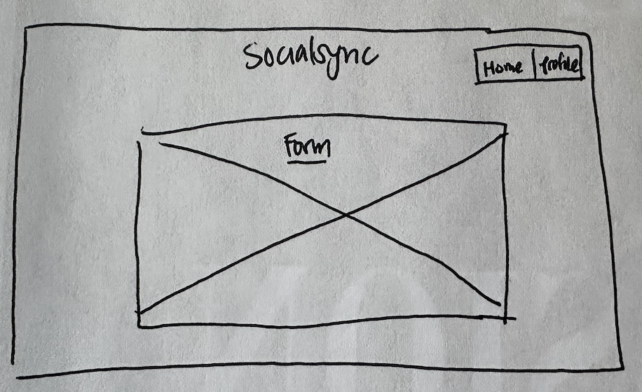
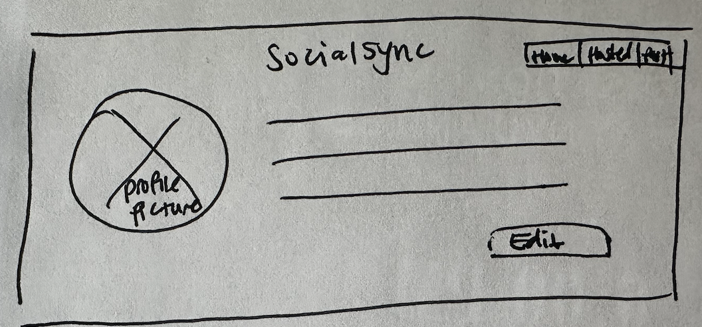
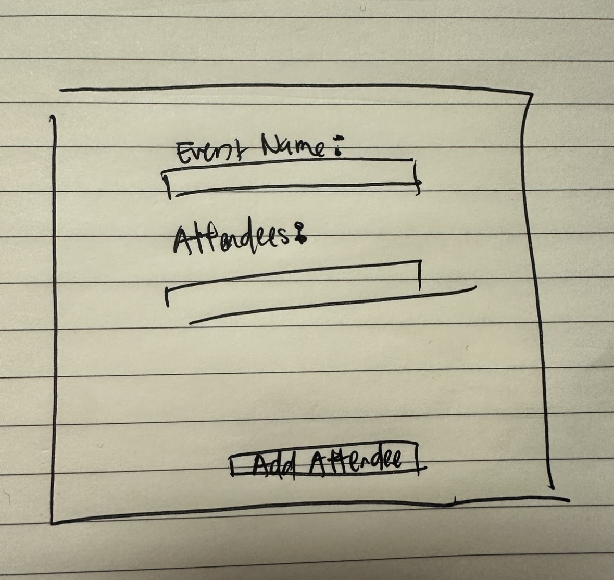
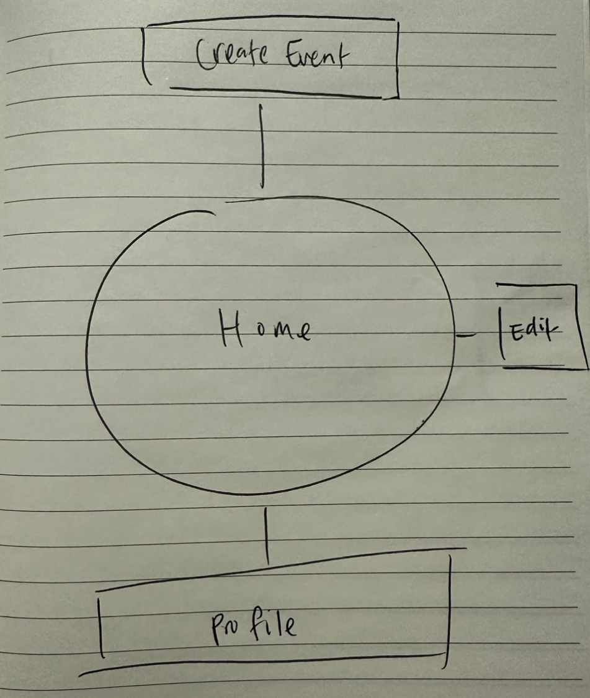

# SocialSync

## Overview

Want to plan a social gathering hassle free?? SocialSync makes planning as easy as 1-2-3!

SocialSync is a web app that will allow users to create multiple events or accept event invitations. Users can register for an account and login. Once logged in, they can create events as an event organizer or accept any incoming event invitations and view its' details. For each event they create, they can edit the date, time, loation, description, and event attendees list. RSVP status will be viewable by the event organizer and the attendees. Attendee RSVP status can be changed at any time up until the day of the event. Both event organizers and attendess are able to review notifications regarding event updates.

## Data Model

The application will store Events, Attendees, and People

* events can have multiple attendees (via references)
* events can have multiple people as organizers (via references)
* each person can be attending & viewing multiple events (via references)

An Example Event:

```javascript
{
  eventName: "Bday Bash",
  startDate: // YYYY-MM-DD Date format,
  endDate: // YYYY-MM-DD Date format,
  startTime: "20:00", 
  endTime: "23:59", 
  location: "NOWHERE",
  cost: 25, 
  description: "get shlitty",
  organizer: // an array of references to Person documents,
  attendees: // an array of references to Attendee documents,
  createdAt: // Date.now
}
```

An Example Person:

```javascript
{
  username: "estherwng",
  passwordHash: // a password hash
  salt: // password salt
  firstName: "Esther",
  lastName: "Wang",
  contact: "esther.wang@nyu.edu",
  organizerStatus: true,
  currentEvents: // an array of references to Event documents,
}
```

## [Link to Commented First Draft Schema](db.mjs) 

## Wireframes

/ - home page for viewing all current attending events



/event-create - page for create new events



/profile - page for viewing and editing profile



/edit-event - page for adding attendees



## Site map



## User Stories or Use Cases

1. as non-registered user, I can register a new account with the site
2. as a user, I can log in to the site
3. as a user, I can create a new event
4. as a user, I can view all events that I will be attending
5. as a user, I can edit attendees of an existing event
6. as a user, I can edit my profile

## Research Topics

* (2 points) Integrate ESLint
* (3 points) Unit Testing with JavaScript
    * Mocha
* (3 points) Configuration Management 
    * dotenv
* (3 points) Perform client side form validation using JavaScript library
* (2 points) External API

13 points total out of 10 required points


## [Link to Initial Main Project File](app.mjs) 

## Annotations / References Used

1. [Mongoose Schema Types](https://mongoosejs.com/docs/schematypes.html) 
2. [Mongoose Working with Dates](https://mongoosejs.com/docs/tutorials/dates.html)

